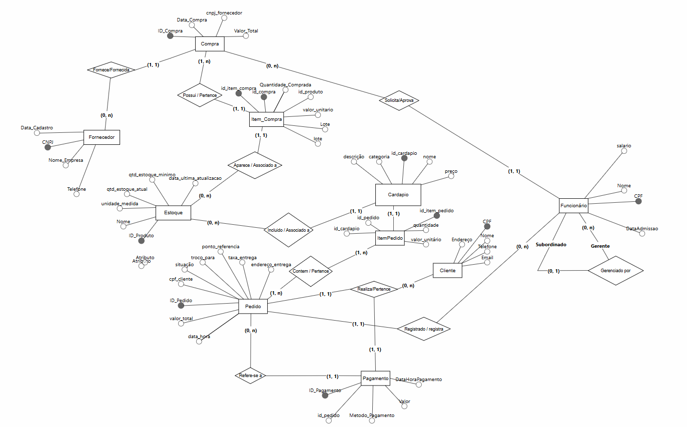

# SGBD-Lanchonete

## Instruções de Execução do Projeto
### Pré-requisitos
- Docker Desktop instalado
- Docker Compose
- Visual Studio Code (opcional)

⚠️ Caso exista uma instalação local do PostgreSQL em execução, recomenda-se **parar o serviço** para evitar conflito de portas com o Docker.

---

### Passo a passo para execução

1. Instale o **Docker Desktop** e conclua todas as etapas do instalador.

2. Clone este repositório ou faça o download dos arquivos do projeto.

3. (Opcional) Caso utilize o **Visual Studio Code**:
   - Instale a extensão **Docker / Container Tools**.
   - Abra o arquivo `docker-compose.yml`.
   - Clique em **Run All Services** para iniciar os containers.

   Alternativamente, execute via terminal:
   ```bash
   docker-compose up -d

## Modelo Conceitual



📄 [Versão em PDF](docs/Modelo%20Conceitual.pdf)

## Dicionário de Dados

📄 [Dicionário de Dados (PDF)](docs/Dicionário%20de%20Dados%20-%20Banco%20de%20Dados%20Att.pdf)

## DML
O banco de dados foi povoado através de comandos scripts contidos no arquivo `init.sql` executados automaticamente na primeira execução do container
