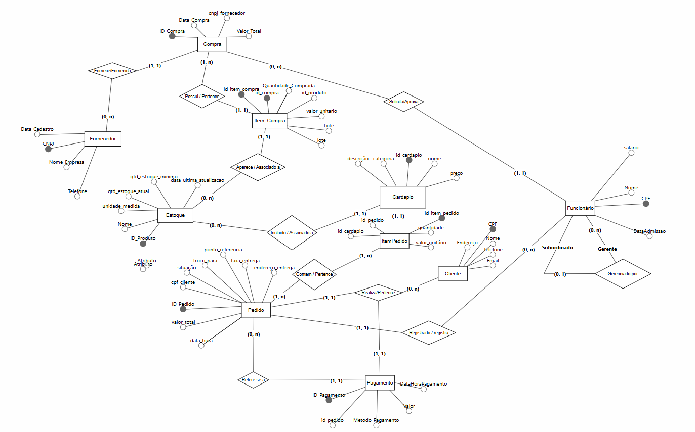
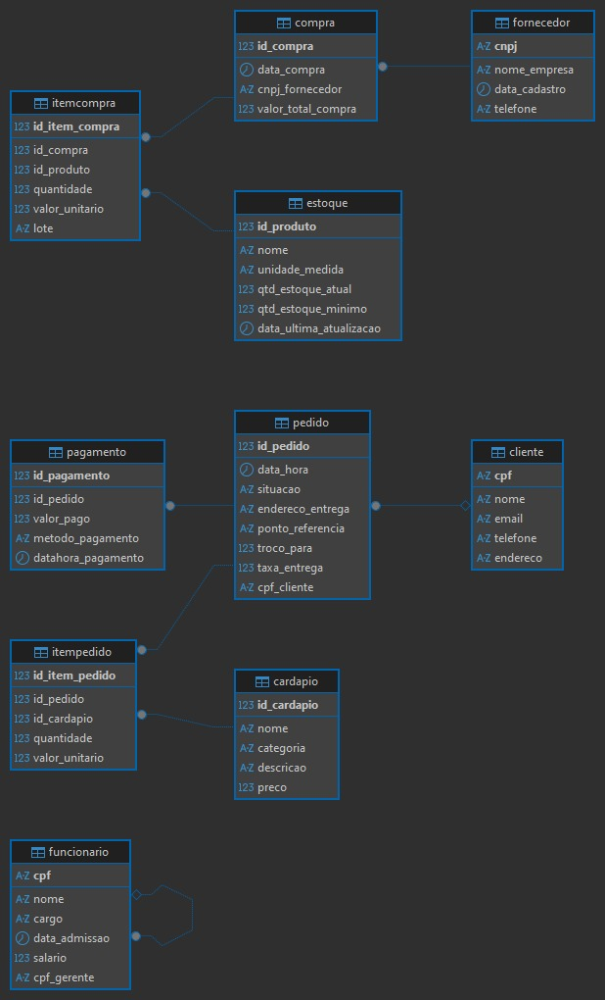

# SGBD-Lanchonete

## Contribuintes
- Ryan Oliveira Marques
- Thayson Guedes de Medeiros
- Luigi Mateo e Silva
- Lucas Henrique de Andrade Silva
- Felipe Mendes Soares Silva

## Instruções de Execução do Projeto
### Pré-requisitos
- Docker Desktop instalado
- Docker Compose
- Visual Studio Code (opcional)

⚠️ Caso exista uma instalação local do PostgreSQL em execução, recomenda-se **parar o serviço** para evitar conflito de portas com o Docker.

---

### Passo a passo para execução

1. Instale o **Docker Desktop** e conclua todas as etapas do instalador.

2. Clone este repositório ou faça o download dos arquivos do projeto.

3. Abra o terminal no diretório do projeto e execute:
```bash
docker-compose up -d
```

3.1 (Opcional) Caso utilize o **Visual Studio Code**:
   - Instale a extensão **Docker / Container Tools**.
   - Abra o arquivo `docker-compose.yml`.
   - Clique em **Run All Services** para iniciar os containers.

3.2 Portas de Acesso
- Após subir os containers, a aplicação estará disponível nas seguintes portas:
- Frontend: `http://localhost:4200`
- Backend:** `http://localhost:8080`
- Banco de Dados:** `localhost:5432`

## Modelo Conceitual



📄 [Versão em PDF](docs/Modelo%20Conceitual.pdf)

## Modelo Entidade Relacionamento



📄 [Versão em PDF](docs/ER_dark.pdf)

## Dicionário de Dados

📄 [Dicionário de Dados (PDF)](docs/Dicionário%20de%20Dados%20-%20Banco%20de%20Dados%20Att.pdf)

## DML
O banco de dados foi povoado através de comandos scripts contidos nos arquivos `01_ddl_criacao.sql` e `02_dml_povoamento.sql` executados automaticamente na primeira execução do container

## Triggers

Para garantir a integridade, rastreabilidade e automação de regras de negócio, foram implementados 3 Triggers diretamente no banco de dados com o arquivo `sql/05_ddl_triggers.sql`.

**1. Histórico de Alteração de Preços do Cardápio**
- Cria um log automático sempre que o preço de um item do cardápio for modificado (`AFTER UPDATE`), salvando o valor antigo e o novo na tabela `log_preco_cardapio`.

**2. Irredutibilidade Salarial de Funcionários**
- Impede reduções salariais. O trigger `trg_valida_salario` atua `BEFORE UPDATE` na tabela `funcionario`. Se o novo salário for menor que o atual, a operação é bloqueada e o banco lança uma exceção.

**3. Atualização Automática da Data do Estoque**
- O trigger `trg_atualiza_data_estoque` atua `BEFORE UPDATE` na tabela `estoque`. Ele intercepta qualquer alteração na quantidade ou dados do produto e injeta automaticamente a data e hora do sistema (`NOW()`) na coluna `data_ultima_atualizacao`, garantindo auditoria temporal precisa.

**Como testar no Console do Banco:**

Teste Trigger 1:
UPDATE cardapio SET preco = 35.00 WHERE id_cardapio = 1;
SELECT * FROM log_preco_cardapio;

Teste Trigger 2:
UPDATE funcionario SET salario = 1000.00 WHERE cpf = '10000000001';

Teste Trigger 3:
UPDATE estoque SET qtd_estoque_atual = 50 WHERE id_produto = 1;